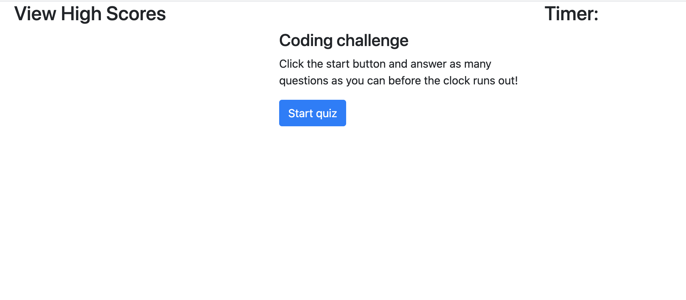
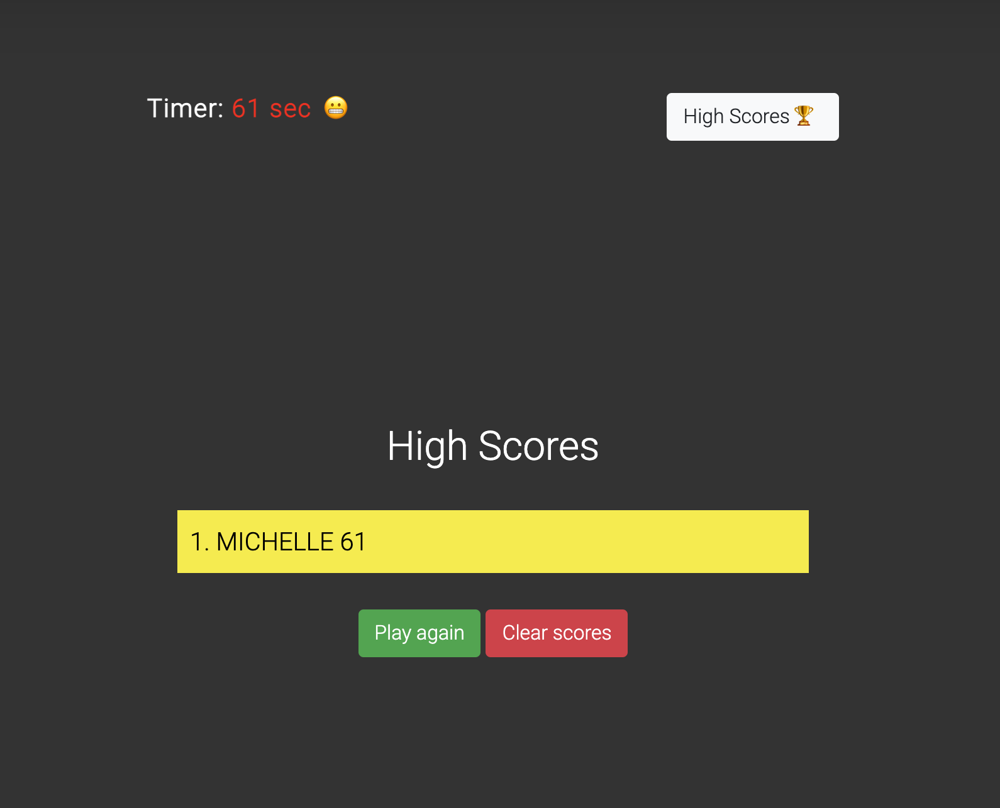
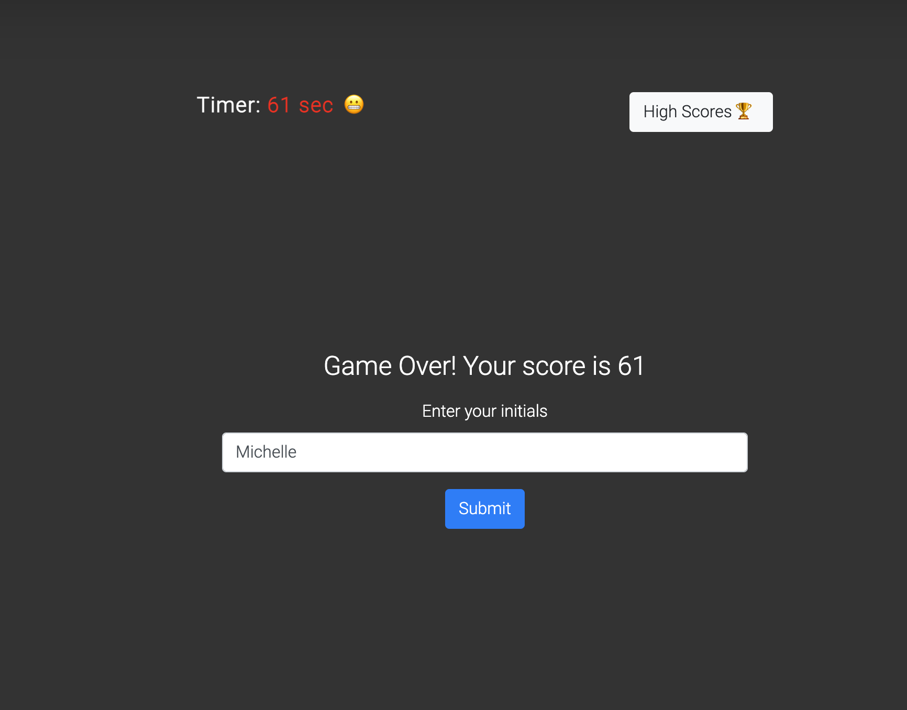

# Code Quiz - submission by Michelle Watts

## Links
### Link to the deployed app is [here](https://michellewatts20000.github.io/code-quiz/)
### Link to the GitHub repo is [here](https://github.com/michellewatts20000/code-quiz)

## Technologies used
HTML, JavaScript, CSS, Bootstrap, JQuery, Open Weather API, FontAwesome and Moment.

## What the app does
You have 75 seconds to answer 5 coding questions. Once you have finished the quiz you will be asked to enter your initials to get yourself on the high scores table. If you leave the website you can return and your score will still be there.

## Screenshot

## Contact
Michelle Watts
watts.e.michelle@gmail.com
